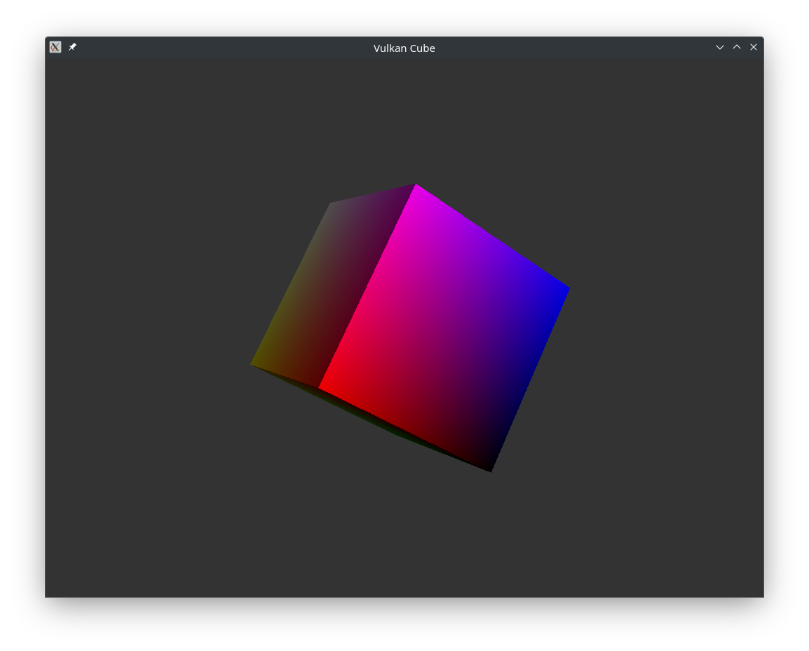

# VK Cube

This program renders a simple colored 3d cube using the Vulkan API.
Only linux with XCB and Wayland is supported.



## Building

```bash
git clone <url>
cd vk_cube
# ALPINE: apk add --no-cache vulkan-loader-dev libdrm-dev libpng-dev ninja-build meson
# UBUNTU: sudo apt-get install libvulkan-dev libdrm-dev libpng-dev ninja-build
# on ubuntu meson must be installed from pip

# Customize the meson build type here (release, debug, debugoptimized, etc.)
meson setup builddir --buildtype=release
meson compile -C builddir
```
